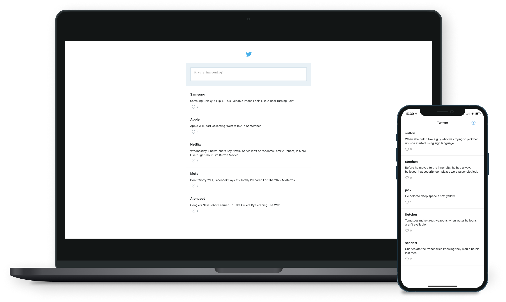

<h1 align="center">
    <br>
    <b>Twitter: Microblogging</b> 🐦
</h1>

<p align="center">
  
  
  
  
</p>

<p align="center">
  <a href="#rocket-technologies">Technologies</a>&nbsp;&nbsp;&nbsp;|&nbsp;&nbsp;&nbsp;
  <a href="#seat-getting-started">Getting started</a>&nbsp;&nbsp;&nbsp;|&nbsp;&nbsp;&nbsp;
  <a href="#thinking-how-to-contribute">How to contribute</a>&nbsp;&nbsp;&nbsp;|&nbsp;&nbsp;&nbsp;
  <a href="#memo-license">License</a>
</p>

<br>

<p align="center">
  
</p>

## :rocket: Technologies

This project was developed with the following technologies:

- [Node.js](https://nodejs.org)
- [React](https://reactjs.org)
- [React Native](https://reactnative.dev)

Extras:

- Main Libs
  - [NestJS](https://nestjs.com)
  - [Mongoose ODM](https://mongoosejs.com)
  - [GraphQL.js](https://graphql.org)
  - [Apollo Server](https://www.apollographql.com/docs/apollo-server)
  - [Apollo Client](https://www.apollographql.com/docs/react)
  - [Next.js](https://nextjs.org)
  - [Expo](https://expo.dev)
- Style
  - [EditorConfig](https://editorconfig.org)
  - [ESLint](https://eslint.org)
  - [Prettier](https://prettier.io)

## :seat: Getting started

These instructions will get you a copy of the full project up and running on your local machine for development and testing purposes.

### Setting up the development environment

You will need to install [Git](https://git-scm.com/downloads), [Docker Desktop](https://www.docker.com/products/docker-desktop) and [Docker Compose](https://docs.docker.com/compose/install/) before following the instructions below.

### Installation using Docker Compose

The following steps need to be performed inside a terminal window (Windows user may prefer to use the [Windows Terminal](https://aka.ms/windowsterminal) but the Command Prompt will also work).

Clone the repository and build Docker images:

```bash
git clone https://github.com/diegomais/twitter.git
cd twitter
docker-compose build
```

### Running the services

Use the following command to run all containers (from within the twitter directory):

```bash
docker-compose up
```

You can now use the API at [http://localhost:4000](http://localhost:4000) and view the Web App in the browser at [http://localhost:3000](http://localhost:3000).

### Mobile

With an Android phone, you can load this project immediately at [https://expo.io/@diegomais/twitter](https://expo.io/@diegomais/twitter).

#### Setting up the development environment

Follow the instructions for Expo CLI available in the official [React Native Documentation](https://reactnative.dev/docs/environment-setup).

#### Adding GraphQL URI

1. Add the GraphQL URI (e.g. `http://localhost:4000/graphql`) into `mobile/src/lib/apollo/client.ts` file.

#### Installing dependencies and running the mobile application

Run the instructions bellow inside `mobile` directory:

1. `npm install`
2. `expo start`

or

1. `yarn install`
2. `expo start`

## :thinking: How to contribute

- Fork this repository;
- Create a branch with your feature: `git checkout -b my-feature`;
- Commit your changes: `git commit -m '[feat](scope) My new feature'`;
- Push to your branch: `git push origin my-feature`.

After the merge of your pull request is done, you can delete your branch.

## :memo: License

This project is under the MIT license. See the [LICENSE](LICENSE) for more details.

---

Made with :heart: by [Diego Mais](https://diegomais.github.io/) :wave:.
